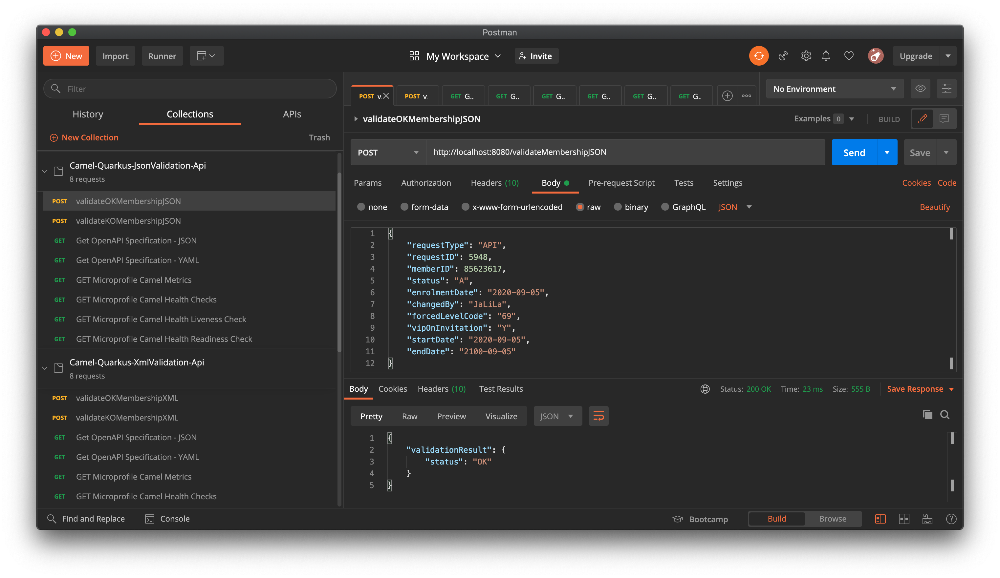

# Camel-Quarkus-JsonValidation-Api project

This project leverages **Quarkus version 1.7.2**, the Supersonic Subatomic Java Framework.

It exposes the following RESTful service endpoints  using the **Apache Camel Quarkus Platform extension**: 
- `/validateMembershipJSON` : validates a sample `Membership` JSON instance through the `POST` HTTP method.
- `/health` : returns the _Camel Quarkus MicroProfile_ health checks
- `/metrics` : the _Camel Quarkus MicroProfile_ metrics

## Prerequisites
- JDK 11 installed with `JAVA_HOME` configured appropriately
- Apache Maven 3.6.2+

## Running the application in dev mode

You can run your application in dev mode that enables live coding using:
```
./mvnw quarkus:dev
```

## Packaging and running the application locally

The application can be packaged using `./mvnw package`.
It produces the `camel-quarkus-jsonvalidation-api-1.0.0-SNAPSHOT-runner.jar` file in the `/target` directory.
Be aware that it’s not an _über-jar_ as the dependencies are copied into the `target/lib` directory.

The application is now runnable using `java -jar target/camel-quarkus-jsonvalidation-api-1.0.0-SNAPSHOT-runner.jar`.

## Packaging and running the application on Red Hat OpenShift

### Pre-requisites
- Access to a [Red Hat OpenShift](https://access.redhat.com/documentation/en-us/openshift_container_platform) cluster v3 or v4
- User has self-provisioner privilege or has access to a working OpenShift project

1. Login to the OpenShift cluster
    ```zsh
    oc login ...
    ```
2. Create an OpenShift project or use your existing OpenShift project. For instance, to create `camel-quarkus`
    ```zsh
    oc new-project camel-quarkus --display-name="Apache Camel Quarkus Apps"
    ```
3. Use either the _**S2I binary workflow**_ or _**S2I source workflow**_ to deploy the `camel-quarkus-jsonvalidation-api` app as described below.

### OpenShift S2I binary workflow 

This leverages the _Quarkus OpenShift_ extension and is only recommended for development and testing purposes.

```zsh
./mvnw clean package -Dquarkus.kubernetes.deploy=true
```
```zsh
[...]
[INFO] [io.quarkus.deployment.pkg.steps.JarResultBuildStep] Building thin jar: /Users/jeannyil/Workdata/myGit/Quarkus/upstream-quarkus-camel-demos/camel-quarkus-jsonvalidation-api/target/camel-quarkus-jsonvalidation-api-1.0.0-SNAPSHOT-runner.jar
[INFO] [io.quarkus.kubernetes.deployment.KubernetesDeploy] Kubernetes API Server at 'https://api.cluster-5d3d.sandbox1856.opentlc.com:6443/' successfully contacted.
[...]
[INFO] [io.quarkus.container.image.s2i.deployment.S2iProcessor] Performing s2i binary build with jar on server: https://api.cluster-5d3d.sandbox1856.opentlc.com:6443/ in namespace:camel-quarkus.
[...]
[INFO] [io.quarkus.container.image.s2i.deployment.S2iProcessor] Successfully pushed image-registry.openshift-image-registry.svc:5000/camel-quarkus/camel-quarkus-jsonvalidation-api@sha256:5cc56e5b72d56a637a163f8972ca27f90296bc265dd1d30c1c72e14a62f2ad93
[INFO] [io.quarkus.container.image.s2i.deployment.S2iProcessor] Successfully pushed image-registry.openshift-image-registry.svc:5000/camel-quarkus/camel-quarkus-jsonvalidation-api@sha256:bd6a27e22810ce84c38ddee840d4f07d84f25a710953e602cd363947a60733e4
[INFO] [io.quarkus.container.image.s2i.deployment.S2iProcessor] Push successful
[INFO] [io.quarkus.kubernetes.deployment.KubernetesDeployer] Deploying to openshift server: https://api.cluster-5d3d.sandbox1856.opentlc.com:6443/ in namespace: camel-quarkus.
[...]
```

### OpenShift S2I source workflow (recommended for PRODUCTION use)

1. Make sure the latest supported OpenJDK 11 image is imported in OpenShift
    ```zsh
    oc import-image --confirm openjdk-11-ubi8 \
    --from=registry.access.redhat.com/ubi8/openjdk-11 \
    -n openshift
    ```
2. Create the `camel-quarkus-jsonvalidation-api` OpenShift application from the git repository
    ```zsh
    oc new-app https://github.com/jeanNyil/upstream-quarkus-camel-demos.git \
    --context-dir=camel-quarkus-jsonvalidation-api \
    --name=camel-quarkus-jsonvalidation-api \
    --image-stream="openshift/openjdk-11-ubi8"
    ```
3. Follow the log of the S2I build
    ```zsh
    oc logs bc/camel-quarkus-jsonvalidation-api -f
    ```
    ```zsh
    Cloning "https://github.com/jeanNyil/upstream-quarkus-camel-demos.git" ...
            Commit: 4911116e6cb9ace7304c7f8b77322b60d3b591f0 (Updated README)
            Author: Jean Armand Nyilimbibi <jean.nyilimbibi@gmail.com>
            Date:   Mon Sep 7 20:34:02 2020 +0200
    [...]
    Successfully pushed image-registry.openshift-image-registry.svc:5000/camel-quarkus/camel-quarkus-jsonvalidation-api-s2i@sha256:f4d91fcda670edd3dd1a8dfa4860fbfbb3cf43a590c67addbec9dc240f4672d4
    Push successful
    ```
4. Create a non-secure route to expose the `camel-quarkus-jsonvalidation-api` service outside the OpenShift cluster
    ```zsh
    oc expose svc/camel-quarkus-jsonvalidation-api
    ```

## Testing the application on OpenShift

1. Get the OpenShift route hostname
    ```zsh
    URL="http://$(oc get route camel-quarkus-jsonvalidation-api -o jsonpath='{.spec.host}')"
    ```
2. Test the `/validateMembershipJSON` endpoint
    ```zsh
    curl -w '\n' -X POST -H 'Content-Type: application/json' \
    -d '{"requestType": "API","requestID": 5948,"memberID": 85623617,"status": "A","enrolmentDate": "2020-09-05","changedBy": "JaLiLa","forcedLevelCode": "69","vipOnInvitation": "Y","startDate": "2020-09-05","endDate": "2100-09-05"}' \
    $URL/validateMembershipJSON
    ```
    ```json
    {
    "validationResult" : {
        "status" : "OK"
    }
    }
    ```

3. Test the `/health` endpoint
    ```zsh
    curl -w '\n' $URL/health
    ```
    ```json
    {
        "status": "UP",
        "checks": [
            {
                "name": "camel-liveness-checks",
                "status": "UP"
            },
            {
                "name": "camel-readiness-checks",
                "status": "UP"
            },
            {
                "name": "camel-context-check",
                "status": "UP",
                "data": {
                    "contextStatus": "Started",
                    "name": "camel-1"
                }
            }
        ]
    }
    ```
4. Test the `/health/live` endpoint
    ```zsh
    curl -w '\n' $URL/health/live
    ```
    ```json
    {
        "status": "UP",
        "checks": [
            {
                "name": "camel-liveness-checks",
                "status": "UP"
            }
        ]
    }
    ```
5. Test the `/health/ready` endpoint
    ```zsh
    curl -w '\n' $URL/health/ready
    ```
    ```json
    {
        "status": "UP",
        "checks": [
            {
                "name": "camel-readiness-checks",
                "status": "UP"
            },
            {
                "name": "camel-context-check",
                "status": "UP",
                "data": {
                    "contextStatus": "Started",
                    "name": "camel-1"
                }
            }
        ]
    }
    ```
6. Test the `/metrics` endpoint
    ```zsh
    curl -w '\n' $URL/metrics
    ```
    ```zsh
    [...]
    # HELP application_camel_context_exchanges_total The total number of exchanges for a route or Camel Context
    # TYPE application_camel_context_exchanges_total counter
    application_camel_context_exchanges_total{camelContext="camel-1"} 20.0
    [...]
    # HELP application_camel_route_exchanges_total The total number of exchanges for a route or Camel Context
    # TYPE application_camel_route_exchanges_total counter
    application_camel_route_exchanges_total{camelContext="camel-1",routeId="api-doc-route"} 0.0
    application_camel_route_exchanges_total{camelContext="camel-1",routeId="common-500-http-code-route"} 0.0
    application_camel_route_exchanges_total{camelContext="camel-1",routeId="custom-http-error-route"} 0.0
    application_camel_route_exchanges_total{camelContext="camel-1",routeId="json-validation-api-route"} 20.0
    application_camel_route_exchanges_total{camelContext="camel-1",routeId="validate-membership-json-route"} 20.0
    [...]
    ```

## Testing using [Postman](https://www.postman.com/)

Import the provided Postman Collection for testing: [tests/Camel-Quarkus-JsonValidation-Api.postman_collection.json](./tests/Camel-Quarkus-JsonValidation-Api.postman_collection.json) 


## Creating a native executable

You can create a native executable using: `./mvnw package -Pnative`.

Or, if you don't have GraalVM installed, you can run the native executable build in a container using: `./mvnw package -Pnative -Dquarkus.native.container-build=true`.

You can then execute your native executable with: `./target/camel-quarkus-jsonvalidation-api-1.0.0-SNAPSHOT-runner`

If you want to learn more about building native executables, please consult https://quarkus.io/guides/building-native-image.